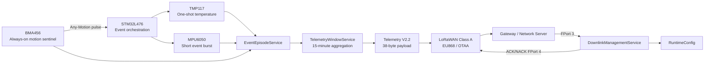

<div align="center">

# 🐄 Electronic Intraruminal Bolus Firmware

### Event-driven cattle sensing • STM32L476 • BMA456 • TMP117 • MPU6050 • LoRaWAN

**Research-oriented embedded firmware for an electronic intraruminal bolus designed to capture temperature, motion, event structure, and compact telemetry while keeping power consumption low.**

`STM32L476` · `BMA456` · `TMP117` · `MPU6050` · `RFM95W / SX1276` · `LoRaWAN EU868`

> **Development status:** active research prototype. Sensor/event/telemetry paths have initial hardware evidence; the current LoRaWAN uplink/downlink integration is **IMPLEMENTED / UNTESTED** and must not be considered production-validated.

</div>

---

## Overview

This repository contains the firmware architecture for an **electronic intraruminal cattle bolus**. The design combines a low-power always-on motion sentinel, precise temperature sensing, short high-detail inertial bursts, event-level aggregation, compact telemetry, and a staged LoRaWAN communication layer.

The central design principle is simple:

> **Keep the expensive parts asleep until the low-power sentinel detects something worth measuring.**

The firmware therefore separates continuous sensing, event detection, high-detail acquisition, telemetry aggregation, radio transport, downlink configuration, and future power-state management into distinct modules.

---

## System Architecture



### Event-driven sensing path

```text
BMA456 interrupt
      ↓
Motion pulse accepted by EventEpisode policy
      ↓
TMP117 immediate one-shot
      +
MPU6050 power ON → short burst → features → power OFF
      ↓
Episode aggregation
      ↓
15-minute telemetry window
      ↓
38-byte Telemetry V2.2
      ↓
LoRaWAN uplink
```

---

## Hardware Stack

| Device | Role | Firmware policy |
|---|---|---|
| **STM32L476** | Main MCU | Coordinates sensing, event logic, telemetry and radio |
| **BMA456** | Low-power accelerometer / sentinel | Intended to remain continuously available for motion/event detection |
| **TMP117** | High-accuracy temperature sensor | One-shot / sparse sampling; shutdown between measurements |
| **MPU6050** | Accelerometer + gyroscope | Normally power-gated; activated for short event-driven bursts |
| **RFM95W / SX1276** | Sub-GHz radio | LoRaWAN transport layer under staged integration |
| **Battery + switched rails** | Power source / isolation | Sensor and radio power domains are managed separately |

The architecture deliberately keeps **BMA Step Counter sensitivity** independent from **BMA Any-Motion/Event sensitivity**. They are separate configuration fields and separate downlink commands.

---

## Firmware Architecture

The repository is organized around small, testable services rather than a single monolithic application loop.

### 1. Sensor Services

#### BMA456

The BMA456 is the low-power sentinel. It provides:

- 3-axis acceleration acquisition;
- hardware Step Counter access;
- Any-Motion event detection;
- independent Step sensitivity and Event sensitivity;
- configurable event profiles;
- interrupt-driven event indication with processing kept outside the ISR.

Current bundled Any-Motion profiles are **engineering calibration candidates**, not validated physiological thresholds for cattle.

| Profile | Threshold | Duration |
|---|---:|---:|
| VERY_LOW | 900 mg | 800 ms |
| LOW | 750 mg | 600 ms |
| LEVEL_1 | 600 mg | 500 ms |
| LEVEL_2 | 500 mg | 400 ms |
| LEVEL_3 | 400 mg | 300 ms |
| LEVEL_4 | 300 mg | 200 ms |
| RAW | direct configuration | direct configuration |
| OFF | disabled | — |

Development default: **LEVEL_2**.

#### TMP117

TMP117 is used as a precise thermal sensor with a sparse, low-energy policy:

- one-shot measurements;
- shutdown between measurements;
- background temperature sampling;
- event-triggered measurements;
- event follow-up trajectory sampling.

Default background period: **600 s**.

#### MPU6050

The MPU6050 is used only when high-detail motion information is useful.

Default event burst:

- **250 ms** duration;
- **100 Hz** sampling;
- approximately **25 samples**;
- ±4 g accelerometer range;
- ±500 dps gyro range.

The burst is reduced online into compact features rather than retaining the raw waveform:

- peak dynamic acceleration;
- RMS dynamic acceleration;
- peak angular velocity;
- RMS angular velocity;
- integrated angular motion;
- roll/pitch change;
- orientation-change magnitude when valid.

---

## Event Episode Engine

A raw BMA interrupt is treated as a **motion pulse**, not automatically as a physiological event.

`EventEpisodeService` groups accepted pulses into higher-level **Event Episodes**.

### Default policy

- retrigger guard: **2 s**;
- episode quiet timeout: **120 s**;
- first pulse starts the Episode;
- accepted later pulses remain inside the same Episode;
- every accepted pulse may trigger an immediate TMP117 measurement and an MPU6050 burst;
- a pulse inside the guard window is suppressed and does not trigger TMP/MPU acquisition.

### Temperature timeline

For a single-pulse Episode:

```text
0 s → +5 s → +15 s → +35 s → +65 s
```

For a multi-pulse Episode, the second accepted pulse cancels the remaining timer-driven follow-ups and subsequent accepted pulses provide naturally timed immediate temperature observations.

These timing values are engineering parameters intended for field calibration; they are **not claimed as validated physiological thresholds**.

---

## Telemetry V2.2

The active firmware aggregates events into a compact fixed-size **38-byte Telemetry V2.2 packet**. Frozen V2 (32-byte) and V2.1 (42-byte) encoders remain available for compatibility, and all three versions remain supported by the network-server decoders.

The normal radio path transports summaries/features, not raw motion waveforms.

### Aggregated information

- Episode count;
- accepted motion-pulse count;
- retrigger-suppressed pulse count;
- maximum pulses per Episode;
- inter-pulse timing statistics;
- current / minimum / maximum temperature;
- maximum negative temperature excursion;
- successful MPU burst count;
- mean/peak motion features;
- battery voltage in millivolts;
- validity / health state;
- native BMA456 Step Counter and XYZ acceleration snapshot.

<details>
<summary><strong>Telemetry V2.2 — exact 38-byte map</strong></summary>

| Byte(s) | Field |
|---|---|
| 0 | protocol v2.2 + message type (`0x41`) |
| 1–2 | sequence |
| 3 | RuntimeConfig version |
| 4 | validity / health / staging bitmap |
| 5–6 | battery mV |
| 7–8 | current temperature, centi-°C |
| 9–10 | minimum temperature, centi-°C |
| 11–12 | maximum temperature, centi-°C |
| 13–14 | signed maximum negative temperature excursion, centi-°C |
| 15 | Episode count |
| 16 | accepted pulse count |
| 17 | guard-suppressed pulse count |
| 18 | maximum pulses per Episode |
| 19 | mean inter-pulse interval, seconds |
| 20 | inter-pulse interval standard deviation, seconds |
| 21 | successful MPU burst count |
| 22 | mean MPU dynamic RMS / 20 mg |
| 23 | peak dynamic acceleration / 20 mg |
| 24 | mean angular-velocity RMS / 10 dps |
| 25 | peak angular velocity / 10 dps |
| 26 | maximum orientation change / 2° |
| 27 | total angular motion / 5° |
| 28–31 | BMA456 Step Counter, uint32 little-endian |
| 32–33 | BMA456 X acceleration, int16 little-endian mg |
| 34–35 | BMA456 Y acceleration, int16 little-endian mg |
| 36–37 | BMA456 Z acceleration, int16 little-endian mg |

</details>

> Battery percentage is derived by the backend when needed. V2.2 does not transmit the unconnected classifier counters or event/reference flags and does **not** claim validated classification of rumen contraction, rotation, drinking, disease, or animal behavior.

---

## LoRaWAN Communication

The branch contains a staged integration of **I-CUBE-LRWAN / LoRaMac** with the existing SX1276/RFM95W radio path.

### Intended network configuration

- **EU868**;
- **LoRaWAN Class A**;
- **OTAA**;
- ADR enabled by default;
- telemetry uplink on **FPort 2**;
- configuration downlink on **FPort 3**;
- ACK/NACK control response on **FPort 4**.

LoRaMAC is intended to own:

- LoRaWAN frame construction;
- MIC and encryption;
- frame counters;
- regional duty-cycle handling;
- RX1 / RX2 timing;
- network-level MAC behavior.

### Uplink management

The staged uplink manager includes:

- copied packet ownership;
- a two-packet telemetry queue;
- bounded retries;
- MAC-busy deferral;
- duty-cycle deferral;
- join / TX diagnostics;
- a dedicated priority control-response slot for ACK/NACK traffic.

### Important status

**LoRaWAN uplink/downlink is currently IMPLEMENTED / UNTESTED.**

Real OTAA credentials are intentionally not stored in the repository. The committed credential file contains non-functional placeholders.

---

## Downlink Configuration

The firmware includes a versioned TLV downlink protocol for remotely changing RuntimeConfig fields.

### Packet format

```text
byte 0    0xD1 request magic
byte 1    protocol version
byte 2    transaction ID
byte 3    command count
byte 4+   repeated [command ID][length][value ...]
```

The parser uses a **candidate configuration**. All commands are decoded first, the complete candidate is validated, and only then is the RuntimeConfig replaced in RAM.

This prevents partially applied multi-command packets.

### Current downlink-addressable groups

#### Motion / Event

- BMA Event sensitivity;
- BMA Step sensitivity;
- Episode retrigger guard;
- Episode quiet timeout;
- Event processing enable/disable.

#### Temperature / MPU

- TMP background sample period;
- MPU burst duration;
- MPU event-trigger enable/disable.

#### Telemetry

- uplink / telemetry-window period.

#### RF / Radio policy

- TX power;
- spreading factor field;
- bandwidth index field;
- coding rate field;
- TX timeout;
- retry delay;
- maximum TX attempts.

> RF command decoding exists, but the corresponding LoRaWAN PHY/MAC live-apply mapping is **not yet validated**. EU868 modulation is governed by the LoRaWAN regional data-rate model, so RF RuntimeConfig values must not be treated as proven live PHY settings yet.

### ACK / NACK

A fixed 8-byte response is staged on FPort 4:

```text
byte 0    0xD2 response magic
byte 1    protocol version
byte 2    transaction ID
byte 3    result code
byte 4-5  pending-apply mask
byte 6-7  RuntimeConfig version
```

A successful command may return **accepted / pending apply** when a service has cached configuration and still requires a live reconfiguration step.

---

## Bolus Downlink Configurator

A small dependency-free helper application is included in:

```text
Bolus_Downlink_Configurator/
```

Open:

```text
Bolus_Downlink_Configurator/index.html
```

in a browser.

The tool allows the user to:

- tick only the settings that must change;
- enter/select new values;
- generate the FPort-3 downlink as spaced HEX;
- generate compact HEX;
- generate Base64;
- manage transaction IDs;
- decode the 8-byte FPort-4 ACK/NACK response.

The configurator runs completely offline and contains no network credentials.

> Configurator and downlink integration are currently **STAGING / UNTESTED**.

---

## Power Architecture

The target low-power architecture is:

```text
BMA456      always available as sentinel
STM32L476   mostly low-power STOP2
TMP117      shutdown except one-shot samples
MPU6050     physically OFF except event bursts
SX1276      sleep except join / TX / RX windows
```

### Current implementation boundary

The complete production low-power scheduler is **not implemented yet**.

Current work still includes:

- `HAL_GetTick()`-based timing in the application;
- cooperative polling;
- periodic BMA reads;
- no completed RTC/LPTIM monotonic scheduler migration;
- no finished STOP2 integration;
- no final measured average-current or battery-life characterization.

Power numbers should therefore be treated as future measurement targets, not as validated battery-life claims.

---

## Validation Status

| Area | Status | Notes |
|---|---|---|
| STM32 / sensor-service bring-up | ✅ Initial hardware evidence | Prototype initialization observed |
| BMA Any-Motion path | ✅ Initial hardware evidence | Interrupt/event path observed |
| Episode retrigger guard | ✅ Controlled hardware observation | Suppressed pulse did not trigger TMP/MPU downstream |
| TMP event acquisition | ✅ Initial hardware evidence | Event-driven samples observed |
| MPU event burst | ✅ Initial hardware evidence | Burst counter and ~25-sample burst observed |
| Telemetry V2.2 encoding | 🟡 Offline codec-tested | 38-byte compact payload; hardware/network validation required |
| Numerical MPU feature quality | 🟡 Pending validation | Requires controlled motion/reference tests |
| LoRaWAN build/integration | 🟡 IMPLEMENTED / UNTESTED | Clean build + hardware/network validation required |
| OTAA join | 🟡 UNTESTED | Real credentials intentionally not committed |
| LoRaWAN telemetry uplink | 🟡 UNTESTED | Gateway/network-server validation required |
| RX1/RX2 downlink | 🟡 UNTESTED | FPort-3 end-to-end test required |
| ACK/NACK control uplink | 🟡 UNTESTED | FPort-4 validation required |
| Downlink live reconfiguration | 🟡 Partial / pending apply | RAM config update staged; cached-service apply remains |
| RF live-apply mapping | 🟡 UNTESTED | Must be mapped correctly to EU868 LoRaMAC data-rate policy |
| STOP2 + RTC/LPTIM | ⬜ Pending | Required for production power management |
| Power characterization | ⬜ Pending | Requires real current measurements |
| Event classifier | ⬜ Pending | Classifier not connected; counters are not transmitted in V2.2 |
| Field/animal validation | ⬜ Pending | Required before physiological interpretation |

---

## Repository Layout

```text
bolus-firmware/
├── App/
│   ├── Application/        # Product-level data models
│   ├── BSP/                # Board-specific support
│   ├── Config/             # RuntimeConfig and LoRaWAN staging config
│   ├── Drivers/            # BMA456, TMP117, MPU6050, battery, RFM95W
│   └── Services/           # Event, sensing, telemetry, RF, uplink/downlink services
│
├── Core/                   # STM32Cube-generated application entry / HAL integration
├── Drivers/                # STM32 HAL / CMSIS
├── ThirdParty/             # I-CUBE-LRWAN / LoRaWAN middleware
├── docs/                   # Phase-5 architecture and validation notes
├── Docs/                   # Additional project documentation
├── Bolus_Downlink_Configurator/
│   ├── index.html          # Offline downlink generator / ACK decoder
│   └── README.md
├── Network_Decoders/       # TTN and ChirpStack uplink decoders
├── tests/                  # Host codec and decoder vector tests
├── tools/                  # Build/integration helper scripts
└── Code.ioc                # STM32CubeMX project configuration
```

---

## Development Workflow

The active architecture work is currently on:

```bash
phase5/application-architecture
```

Clone and switch to the branch:

```bash
git clone https://github.com/ehsanh95/bolus-firmware.git
cd bolus-firmware
git checkout phase5/application-architecture
```

For the staged LoRaWAN CubeIDE integration:

```bash
python tools/enable_lorawan_cubeide.py
```

Then refresh the project in STM32CubeIDE and perform a clean Debug build.

### Credentials

Do **not** commit production OTAA keys to this repository.

The tracked credential header intentionally contains zero placeholders and keeps provisioning disabled until credentials are supplied through a private/local workflow.

---

## Engineering Principles

This project intentionally distinguishes between:

- **implemented code**;
- **clean-build evidence**;
- **hardware evidence**;
- **network/gateway evidence**;
- **measured power evidence**;
- **field/animal validation**.

A feature is not considered validated merely because the code exists.

Likewise, motion/temperature parameters derived from literature or engineering iteration are treated as **research benchmarks and calibration candidates**, not clinical diagnoses or universal cattle thresholds.

---

## Current Roadmap

```text
Sensor + Event Pipeline
        ✅
        ↓
Telemetry V2.2
        🟡 offline codec-tested
        ↓
LoRaWAN Uplink
        🟡 implemented / untested
        ↓
Downlink + ACK/NACK
        🟡 implemented / untested
        ↓
Live Config Apply + Persistence
        ⬜
        ↓
STOP2 + RTC/LPTIM + Leakage Reduction
        ⬜
        ↓
Measured Power Characterization
        ⬜
        ↓
Classifier + Field Calibration
        ⬜
```

---

## Important Research Disclaimer

This repository represents an **experimental engineering and research platform**.

It is not a veterinary diagnostic device, and current thresholds, event rules, temperature references, future classifier outputs, and RF/power assumptions must not be interpreted as validated medical, physiological, or production claims without dedicated field validation.

---

<div align="center">

**Electronic Intraruminal Bolus — event-driven sensing, compact telemetry, and staged LoRaWAN control.**

</div>
